<div align="center">


</div>


# Hotel Management System

A comprehensive Java-based hotel management system(Management-side) with a **JavaFX GUI** for managing reservations, rooms, staff, and financial operations. Also includes a full-featured desktop application in the releases section of the repository built with C# WPF and .NET 8, evolved from the original Java demonstration project. Install the windows installer or run the portable(no install) application to visualize two different interfaces and UI using the same codebase.
 This system provides dual-access portals for both guests and administrators with features including booking management, room inventory, staff authentication, and financial reporting.

**Note:** This is an educational/demo project for learning purposes. It is not industry-grade


## Application Demo


<div align="center">


<br><br>


<p>
<b>Guest Portal</b> • <b>Admin Portal</b>
</p>

</div>


## Support The Project

<div align="center">

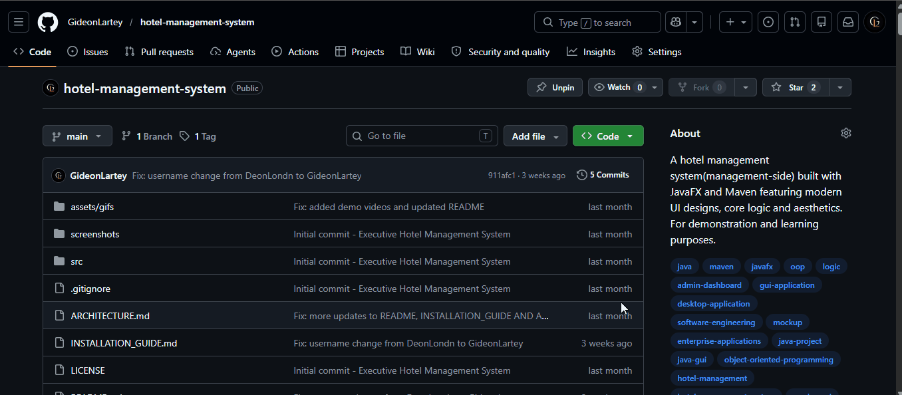

<p>
<b>Click The ⭐ Star Button To Support The Project</b>
<p>

</div>


## Features

## 🤼 Guest Portal
- **Room Search & Browse** - Search available rooms by date and type
- **Booking Management** - Create and manage hotel reservations
- **Check-in/Check-out** - Process guest arrivals and departures
- **Multiple Room Types** - Standard, Deluxe, Executive Suite, VIP Suite, and Penthouse

## 👨‍💼 Admin Dashboard
- **Staff Management** - User authentication and staff directory
- **Room Management** - Manage room inventory and status
- **Financial Reports** - Track revenue and expenses
- **Housekeeping** - Schedule and track room cleaning and maintenance
- **Inventory Tracking** - Manage hotel supplies and amenities
- **Dynamic Pricing** - Seasonal and promotional pricing management


## 🍵JAVA USER INTERFACE

The application features a **professional JavaFX GUI** with:
- ✅ Windows-like graphical interface
- ✅ Intuitive menu navigation
- ✅ Form-based data entry
- ✅ Real-time information display
- ✅ Responsive button controls
- ✅ Executive UI Redesign: Redesigned the entire JavaFX interface with a luxury hotel-inspired aesthetic. Added a cinematic sunset background across all major application pages. Implemented transparent/glassmorphism-inspired 
overlays for a modern executive dashboard feel. Refined UI spacing, layout hierarchy, and visual consistency across 
all screens.
- ✅ Background & Layout Improvements: Implemented reusable applyBackground() method for global page theming.
Fixed JavaFX background scaling to fully cover the application window. Removed default JavaFX white borders, 
separators, and viewport backgrounds. Eliminated unwanted container outlines and optimized transparency blending.


## 🪟WINDOWS DESKTOP WRAPPER INTERFACE(C# / WPF)
This repository includes a C# WPF project used to package the Java-based Hotel Management System as a Windows desktop application and installer. The C# section of the project provides: native windows installer, windows application creation, application packaging and windows desktop integration.

**✨FEATURES(UI)**

- **User Authentication** — BCrypt password hashing, admin-managed staff access, role-based permissions (Manager / Receptionist / Housekeeper), account lockout after failed attempts
- **Guest Management** — Full booking lifecycle: registration → payment → check-in → check-out
- **Room Operations** — 25 rooms across 5 types, real-time availability search, date conflict detection
- **Financial Reports** — Revenue tracking, occupancy rates, average room rates, completed booking history
- **Housekeeping** — Cleaning records, room status transitions, cleaning log
- **Inventory Management** — Stock tracking with low-stock alerts and restocking
- **Dual Currency** — Switch between GH₵ (Ghana Cedi) and $ (US Dollar) at any time
- **Rate Management** — Season-specific pricing matrix (Peak, Regular, Special, Slow Business, Holiday)
- **SQLite Database** — All data persisted locally at `%APPDATA%/LantelHotel/hotel.db`

**MAIN FILES**

- App.xaml
- MainWindow.xaml
- MainWindow.xaml.cs
- LantelHotelApp.csproj
- setup.iss

**💻SYSTEM REQUIREMENTS**
- Windows 10/11 (64-bit)
- No additional software required (self-contained .NET 8 runtime)


### Build:

```bash
dotnet build 
```

### Run

```bash
dotnet run 
```

Publish

```bash
dotnet publish -c Release
```

**Create Installer**
Install Inno Setup and compile:
**setup.iss**


## System-Wide Administrative Workflow Expansion

Expanded the Admin Dashboard into a more realistic management system by adding workflow action panels:

```
## Staff Management
Add Staff
Assign Roles
Attendance Tracking

# Room Management
Add Room
Available Rooms
Maintenance Mode

# Financial Reports
Revenue Summary
Occupancy Report
Export Reports

# Housekeeping
Create Cleaning Tasks
Room Status
Maintenance Requests
```


## 🚹 Room Categories & Pricing

| Room Type | Price/Night | Features |
|-----------|------------|----------|
| Standard | $80 | Basic amenities |
| Deluxe | $150 | Enhanced comfort |
| Executive Suite | $300 | Premium facilities |
| VIP Suite | $500 | Luxury experience |
| Penthouse | $1000 | Ultimate luxury |

## 🛠️ JAVA System Requirements

- **Java:** JDK 11 or higher (JavaFX requires Java 11+)
- **Maven:** 3.6.0 or higher
- **OS:** Windows, macOS, or Linux with graphical desktop
- **RAM:** 512 MB minimum

## 🚪JAVA Installation

### 1. Clone the Repository
```bash
git clone https://www.github.com/GideonLartey/hotel-management-system.git
cd hotelmanagementsystem
```

### 2. Build with Maven
```bash
mvn clean install
```

### 3. Run the Application

### Option 1: Using Maven Javafx (Recommended)**
```bash
mvn javafx:run
```

### Method 2: Using Maven Exec Plugin 
```bash
mvn exec:java -Dexec.mainClass="com.lantel.ui.HotelManagementGUI"
```

### Alternative: Run CLI Version**
```bash
mvn exec:java -Dexec.mainClass="com.lantel.ui.HotelManagementCLI"
```

### Option 3: Run JAR directly**
```bash
java -jar target/hotelmanagementsystem-1.0-SNAPSHOT.jar
```

### Option 4: From IDE**
- IntelliJ: Right-click `HotelManagementGUI.java` or `HotelManagementCLI.java` → Run
- Eclipse: Right-click `HotelManagementGUI.java` or `HotelManagementCLI.java` → Run As → Java Application
- VS Code: Click "Run" button above main() method

## Default Admin Credentials

| Username | Password | Role |
|----------|----------|------|
| admin | admin123 | System Administrator |
| receptionist | recept123 | Front Desk Staff |
| housekeeper | house123 | Housekeeping Staff |

> **Security Note:** Change these credentials immediately in a production environment.

## Usage Guide

### For Guests
1. Launch the application - Main menu window appears
2. Click "Guest Portal" button
3. Browse available rooms by entering check-in and check-out dates
4. Select desired room type and click "Search"
5. Proceed with check-in on arrival date
6. Check out on departure date

### For Administrators
1. Launch the application - Main menu window appears
2. Click "Admin Dashboard" button
3. Enter admin credentials (username: "admin", password: "admin123")
4. On successful login, Admin Dashboard opens with menu options:
   - **Staff Management** - View and manage hotel staff
   - **Room Management** - Control room inventory and availability
   - **Financial Reports** - View revenue and profit analysis
   - **Housekeeping** - Schedule room cleaning and maintenance
5. Click "Logout" to exit


## 📸 Application Screenshots

<div align="center">

### Guest Experience

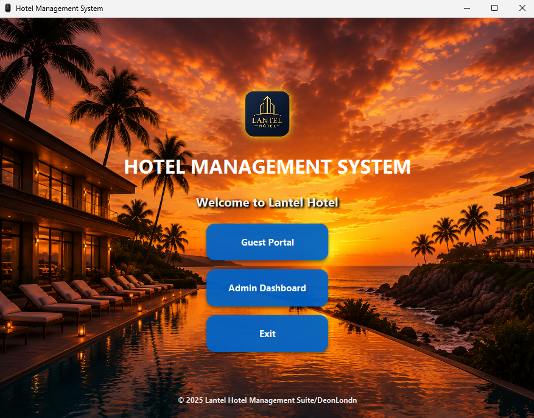
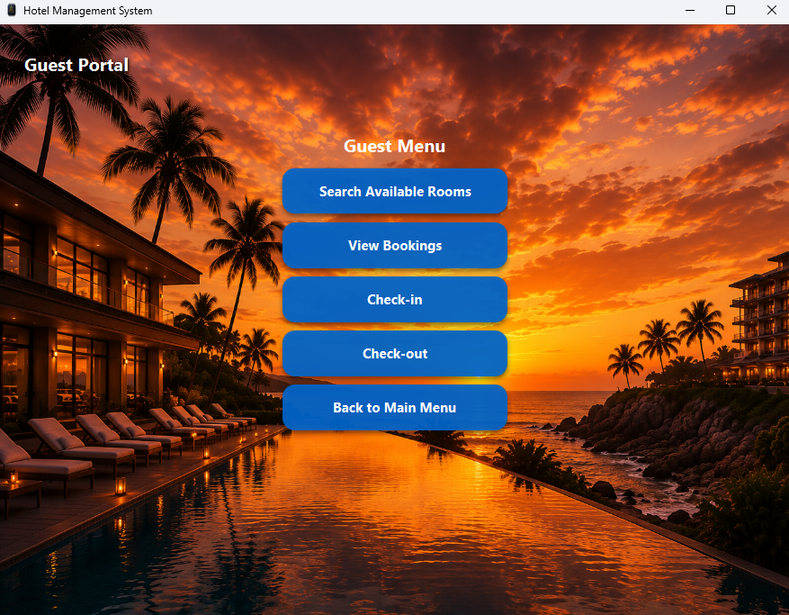
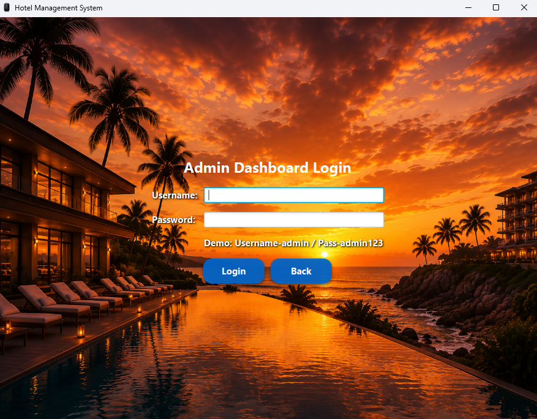

<p>
<b>Home Page</b> • <b>Guest Portal</b> • <b>Admin Login</b>
</p>

---

### Room Operations

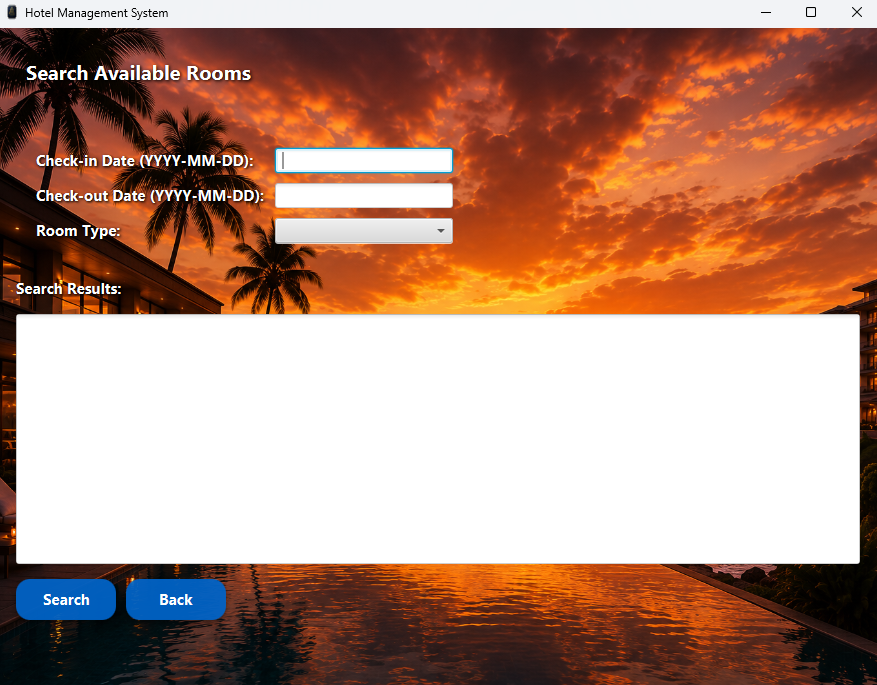
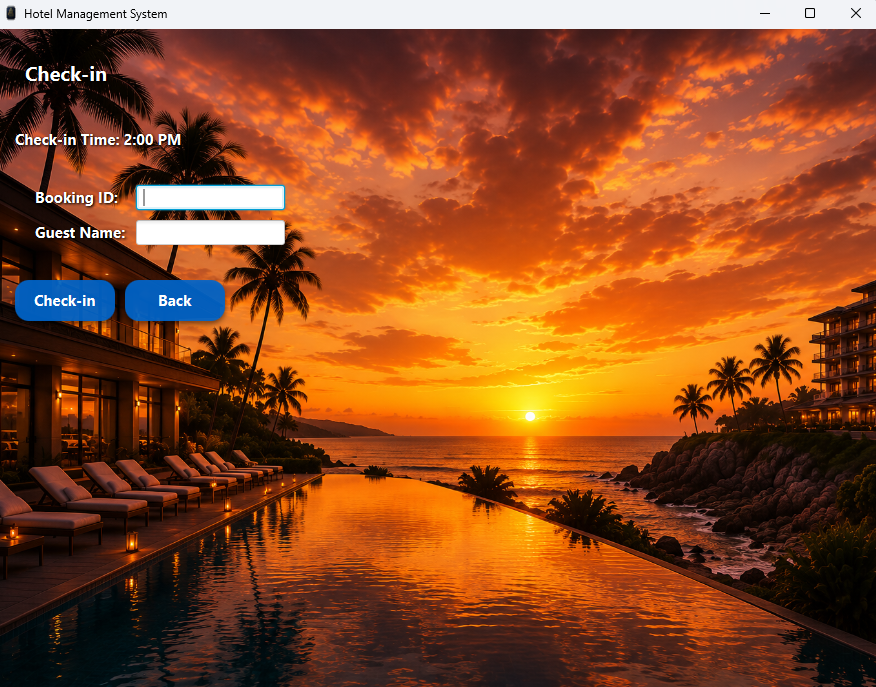
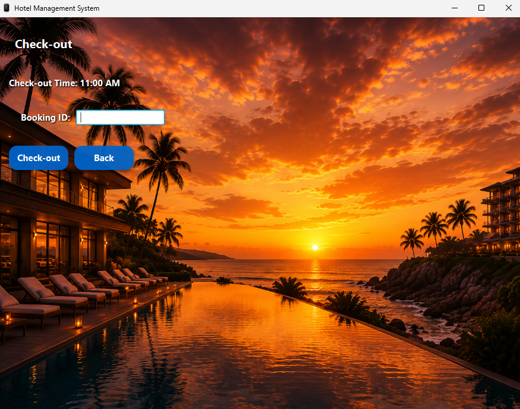

<p>
<b>Search Rooms</b> • <b>Check-in</b> • <b>Check-out</b>
</p>

---

### Administration & Reports

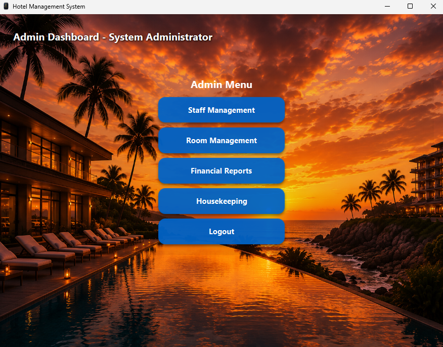
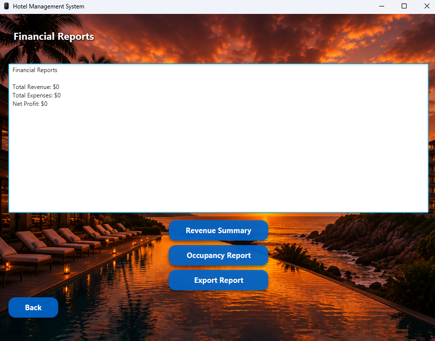
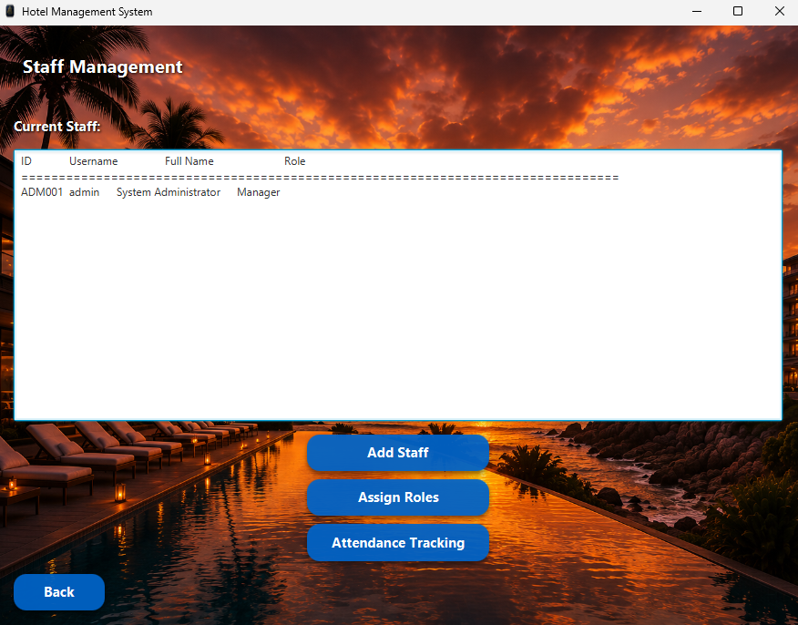

<p>
<b>Admin Dashboard</b> • <b>Financial Reports</b> • <b>Staff Management</b>
</p>

---

### C# Windows Portable Application(no install)

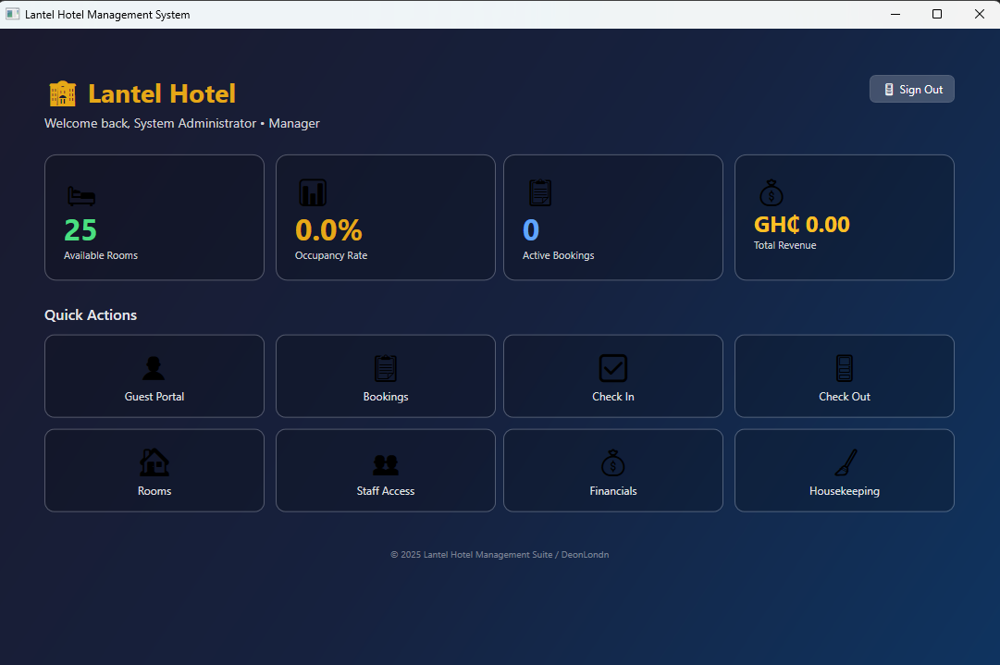
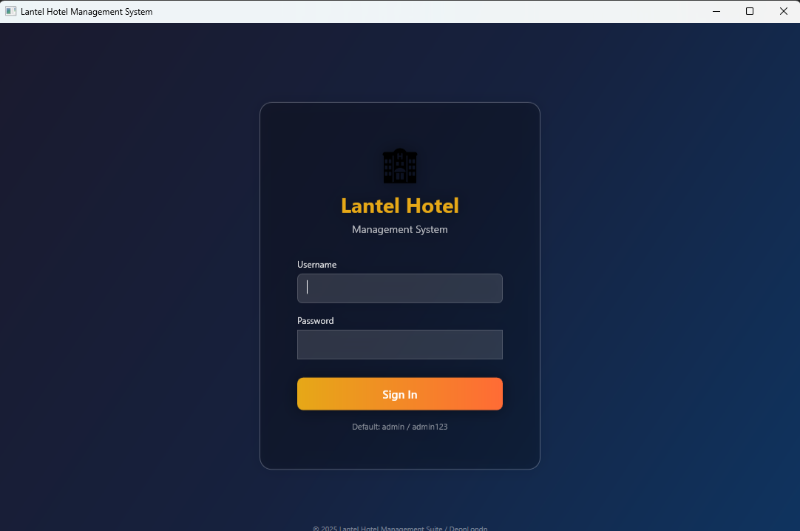

<p>
<b>Exe Dashboard</b> • <b>Exe Home Screen</b> 
</p>


</div>


## �📁Project Structure

```bash
hotelmanagementsystem/
├── src/
│   ├── main/java/
│   │   └── com/lantel/
│   │       ├── App.java (Entry point)
│   │       ├── admin/
│   │       │   ├── AdminUser.java
│   │       │   ├── StaffManager.java
│   │       │   ├── FinancialReport.java
│   │       │   ├── HousekeepingTracker.java
│   │       │   └── RoomRateManager.java
│   │       ├── booking/
│   │       │   ├── Booking.java
│   │       │   ├── BookingManager.java
│   │       │   └── BookingList.java
│   │       ├── guest/
│   │       │   ├── Guest.java
│   │       │   └── GuestBook.java
│   │       ├── room/
│   │       │   ├── GuestRoom.java
│   │       │   ├── RoomInventory.java
│   │       │   └── Enums (RoomType, GuestRoomStatus, etc.)
│   │       └── ui/
│   │           ├── HotelManagementCLI.java (CLI entry point)
│   │           └── HotelManagementGUI.java (JavaFX GUI entry point)
│   └── test/java/
├── pom.xml
├── .gitignore
├── INSTALLATION_GUIDE.md
├── QUALITY_REPORT.md
├── ARCHITECTURE.md
├── LICENSE
└── README.md
```


## ⚠️Key Policies

- **Guest Age Requirement:** Minimum 18 years old
- **Check-in Time:** 2:00 PM - UNIVERSALLY ACCEPTED CHECK-IN TIME
- **Check-out Time:** 11:00 AM - UNIVERSALLY ACCEPTED CHECK-OUT TIME
- **Booking Validation:** Check-out date must be after check-in date
- **Room Conflicts:** System prevents double-booking of rooms


## Architecture

The system follows a **Layered Architecture** pattern:

- **UI Layer** - JavaFX GUI for user interaction with professional Windows-like interface
- **Business Logic Layer** - Managers handling domain operations
- **Model Layer** - Data entities (Guest, Booking, Room, etc.)

See [ARCHITECTURE](https://github.com/GideonLartey/hotel-management-system/blob/main/ARCHITECTURE.md) for detailed system design.


## ⚙️JAVA Technology Stack

- **Language:** Java 21+ (for JavaFX support)
- **GUI Framework:** JavaFX 21
- **Build Tool:** Apache Maven 3.x
- **Testing Framework:** JUnit 4
- **Date/Time:** Java Time API
- **Data Storage:** In-memory collections (ArrayList, HashMap)

## ## 🛠️ C# Tech Stack
C# / WPF / .NET 8 / SQLite (EF Core) / BCrypt / MVVM Architecture


## Improvements

- User authentication	- BCrypt auth -  OAuth/SSO/2FA
- Database - SQLite (local)


## JAVA Testing

Run unit tests:
```bash
mvn test
```

Run specific test:
```bash
mvn test -Dtest=TestClassName
```

## 💭Future Enhancements
To reach true industry-grade, the project would need the folowing enhancements:

- [ ] Database integration (MySQL/Cloud PostgreSQL/ Supabase/ firebase)
- [ ] Email notifications
- [ ] Payment gateway integration - Stripe/PayPal/POS terminal integration
- [ ] Web-based UI
- [ ] Mobile app
- [ ] Advanced reporting analytics
- [ ] Customer loyalty program
- [ ] Audit logging - Full audit trail for compliance
- [ ] Accessibility - Web Content Accessibility Guidelines (WCAG) compliance
- [ ] Caching - Redis


## 📜License

This project is licensed under the MIT License - see [LICENSE](https://github.com/GideonLartey/hotel-management-system/blob/main/LICENSE) file for details.


## 🤝Support

For issues and questions:
- Create an Issue on GitHub or fork it to improve the codebase.


## 📚 Authors

- **Developer:** Gideon Lartey (aka DeonLondn)


---

